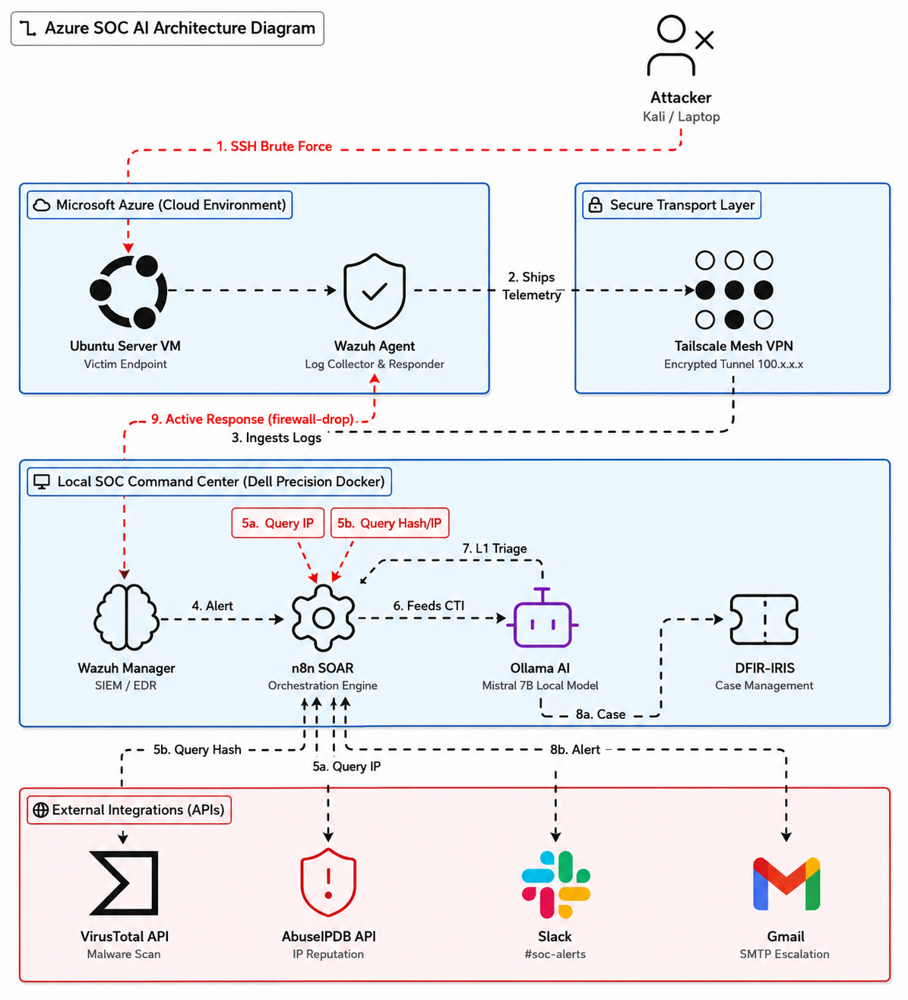

# 🛡️ Abtech Autonomous AI-SOC Pipeline

An end-to-end, self-hosted Autonomous SOC pipeline integrating Azure Cloud telemetry, Wazuh EDR/SIEM, a secure **Tailscale Mesh VPN**, n8n SOAR, DFIR-IRIS case management, and private local LLM threat analysis.

From the moment an attacker breaches the perimeter to the moment they are actively blocked by the firewall and reported on, the entire process takes **under 30 seconds** with zero human intervention.

## 🏗️ Architecture & Tech Stack

This project utilizes a Hybrid Cloud-Local architecture to maximize security and eliminate cloud-computing costs.

*   **The Victim (Cloud):** Azure VM (Ubuntu) exposed to the internet.
*   **The Brain (Local):** Dell Precision (32GB RAM, NVIDIA GPU) running Dockerized services.
*   **The Secure Bridge:** Tailscale Mesh VPN (Encrypted peer-to-peer tunnel).

### 🛠️ Tools Utilized
*   **EDR & SIEM:** Wazuh (Single-Node Docker Deployment)
*   **SOAR:** n8n (Workflow Orchestration)
*   **Case Management:** DFIR-IRIS
*   **Secure Tunneling:** Tailscale VPN (Enables secure hybrid data transport without port forwarding)
*   **Threat Intelligence:** AbuseIPDB & VirusTotal APIs
*   **AI Analyst:** Ollama (Mistral 7B) running locally on NVIDIA GPU
*   **Notifications:** Slack (Custom Bot API) & Gmail (SMTP)

## ⚙️ The Automated Workflow (How it Works)

1.  **Detection:** Wazuh Agent on the Azure VM detects a malicious event (e.g., SSH Brute Force).
2.  **Log Shipping:** Logs are securely forwarded to the local Wazuh Manager over the Tailscale VPN.
3.  **Orchestration Trigger:** Wazuh fires a JSON Webhook to the n8n SOAR engine.
4.  **Parallel Enrichment:** n8n simultaneously queries AbuseIPDB and VirusTotal for attacker IP reputation.
5.  **AI Analysis:** The raw logs and CTI data are fed into a local Mistral 7B LLM. The AI acts as a Level 1 Analyst, summarizing the attack, scoring the threat, and recommending mitigations.
6.  **Case Generation:** n8n pushes the AI's triage report into DFIR-IRIS, creating a formal Incident Ticket and attaching the attacker's IP as an IOC.
7.  **Alerting:** The AI report is instantly formatted and pushed to a dedicated `#soc-alerts` Slack channel and sent via Email.
8.  **Active Response (Containment):** If the alert hits the severity threshold, Wazuh automatically executes a `firewall-drop` script on the Azure VM, instantly severing the attacker's connection.

## 🥷 Red Team Simulation

To validate the pipeline, a custom Bash script (`simulate_attacks.sh`) was written to emulate modern APT and Ransomware affiliate tactics.

## 📂 Repository Contents
*   `simulate_attacks.sh`: The Red Team simulation script.
*   `custom-n8n`: The custom Wazuh integration Python script used to forward JSON payloads to n8n.
*   `Wazuh_SIEM_Operations_Guide.md`: Standard Operating Procedure (SOP) documentation for maintaining this infrastructure.
